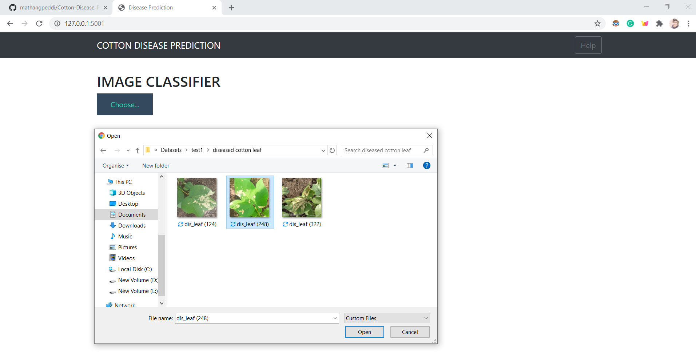
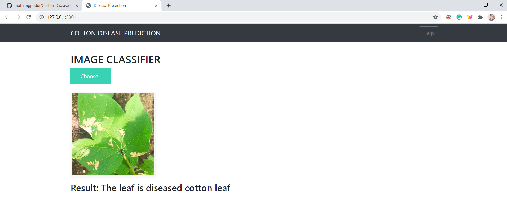

# Cotton-Disease-Prediction

<ul>
  <li>Created a web app that determines a leaf/plant as diseased/normal.</li>
  <li>The dataset consists of 4 categories: diseased cotton leaf, diseased cotton plant,fresh cotton leaf, fresh cotton plant</li>
  <li>I had used the traditional CNN method and achieved an accuracy of 82%. Again I took the help of Transfer Learning and had applied the ResNet152V2 model for my dataset and got an accuracy of 98% for 20 epochs. </li>
</ul>

# Links and Resources Used
<ul>
   <li>Keras Appliactions: <a href="https://keras.io/api/applications/">https://keras.io/api/applications/</a></li>
   <li>Dataset link: <a href="https://drive.google.com/drive/u/0/folders/1A3Z8_MVoGmyJwNOqzRFZncEoBrTZtxO4">https://drive.google.com/drive/u/0/folders/1A3Z8_MVoGmyJwNOqzRFZncEoBrTZtxO4</a></li>
   <li>Packages: pandas, numpy, tensorflow, keras, flask</li>
</ul>

# Model Building
Used Transfer Learning and with the help of ResNet152V2 model I had achieved an accuracy of 98% for 20 epochs. 

# Web App

